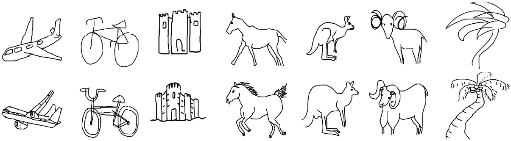

# awesome-sketch-recognition

This project aims at providing a comprehensive performance comparison of existing methods and collecting good papers for freehand sketch recognition.

## Datasets

**TU-Berlin**

The [TU-Berlin dataset](http://cybertron.cg.tu-berlin.de/eitz/projects/classifysketch) has 20,000 freehand sketches collected by Amazon Mechanical Turk (AMT). All sketches are equally distributed in 250 object classes, i.e. each class has 80 sketches. After constructing the dataset, the authors conduct a human classification experiment. The result shows that human can only correctly recognize 73.1% of sketches, which demonstrates that freehand sketch recognition is a very challenging task.

**Sketchy-R**

The [Sketchy dataset](http://sketchy.eye.gatech.edu/) is published for the task of sketch-based image retrieval, which consists of 75,471 sketch images unevenly distributed in 125 object classes. Among the 125 classes, there are 100 categories which also exist in the TU-Berlin dataset. Because of the mistake in the process of human drawing, there are 918 sketches marked as erroneous. The ***Sketchy-R dataset*** abandons these completely wrong samples and saves the other 74,553 sketches.

## Results

If you're using results listed below for your paper or report, please cite:

> @article{zheng2019sketch,
> title={Sketch-Specific Data Augmentation for Freehand Sketch Recognition},
> author={Zheng, Ying and Yao, Hongxun and Sun, Xiaoshuai and Zhang, Shengping and Zhao, Sicheng and Porikli, Fatih},
> journal={arXiv:1910.06038},
> year={2019}
> }

- **TU-Berlin**

|Methods|split1|split2|split3|average|
|:-:|:-:|:-:|:-:|:-:|
|SqueezeNet1.0|61.32|54.06|60.30|58.56|
|SqueezeNet1.1|63.38|59.59|63.82|62.26|
|AlexNet|68.63|68.61|69.48|68.91|
|Inception V3|74.45|75.69|75.08|75.07|
|VGG-11|74.31|72.86|72.95|73.37|
|VGG-13|75.22|72.55|73.35|73.71|
|VGG-16|75.17|74.62|74.25|74.68|
|VGG-19|76.42|74.92|75.97|75.77|
|ResNet-18|75.40|73.16|73.24|73.93|
|ResNet-34|76.58|76.76|76.95|76.76|
|ResNet-50|76.92|76.76|77.48|77.05|
|ResNet-101|78.09|78.83|79.59|78.84|
|**ResNet-152**|**79.25**|**79.79**|**80.03**|**79.69**|
|DenseNet-121|77.23|76.74|76.19|76.72|
|DenseNet-169|78.42|77.97|78.80|78.40|
|DenseNet-201|79.05|78.50|79.11|78.89|
|**DenseNet-161**|**79.85**|**79.32**|**79.48**|**79.55**|

- **Sketchy-R**

|Methods|split1|split2|split3|average|
|:-:|:-:|:-:|:-:|:-:|
|ResNet-152|92.50|92.96|93.11|92.86|
|DenseNet-161|92.02|92.63|92.83|92.49|
|**SSDA**|**95.39**|**95.74**|**95.57**|**95.57**|

## Papers

## Todo

- [ ] add more papers
- [ ] add evaluation metrics
- [ ] add results on TU-Berlin and Sketchy dataset

## Contact

If you have any questions or suggestions, please contact zhengyinghit@outlook.com.
